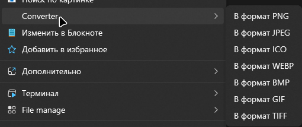

# Windows Image Converter 🔮

Удобная утилита для быстрой конвертации изображений прямо из контекстного меню Windows. Программа работает в фоновом режиме, прячется в системном трее и поддерживает автозагрузку.

 
*(Заметка для тебя: переименуй screen.png на реальное название твоей картинки в папке screenshots)*

## 🚀 Возможности

* **Конвертация в 1 клик:** Добавляет пункты конвертации в классическое контекстное меню Windows (Правый клик).
* **Поддержка множества форматов:** PNG, JPEG, ICO, WEBP, BMP, GIF, TIFF.
* **Умная обработка:** Автоматически убирает прозрачный фон при конвертации в JPEG/BMP и правильно кадрирует иконки (ICO).
* **Системный трей:** Программа аккуратно висит возле часов и не мешает работе.
* **Автозагрузка:** Возможность включать/выключать старт вместе с Windows прямо из меню в трее.

## 🛠️ Установка и запуск

1. Склонируйте репозиторий:
   ```bash
   git clone [https://github.com/dimalinau-lab/Windows-Image-Converter.git](https://github.com/dimalinau-lab/Windows-Image-Converter.git)