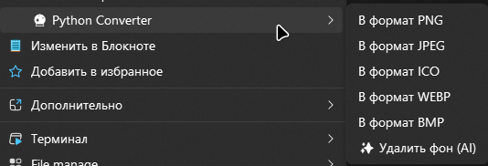

# Windows Image & AI Converter (Converter)

Удобная утилита для быстрой обработки файлов прямо из контекстного меню Windows. Программа работает в фоновом режиме, прячется в системном трее, автоматически интегрируется в систему при первом запуске, умеет вырезать фон с помощью ИИ и конвертировать документы без всплывающих окон консоли.



## Возможности

* **Автоматическая настройка:** При первом запуске утилита сама бесшумно прописывает меню **Converter** в реестр Windows — никаких лишних ручных действий.
* **Конвертация в 1 клик:** Быстрый доступ к смене форматов через классическое контекстное меню Windows (Правый клик).
* **Индикация процесса (Progress Toast):** При запуске конвертации в правом нижнем углу экрана появляется аккуратное окно с индикатором прогресса и именем обрабатываемого файла, которое автоматически закрывается по завершении.
* **Удаление фона (AI):** Автоматически вырезает фон с изображений с помощью встроенной нейросети прямо из проводника.
* **Высокоскоростная работа с документами:** Быстрый перевод PDF в DOCX, а также DOC и DOCX в PDF через оптимизированный COM API с обходом сетевых таймаутов принтеров.
* **Поддержка множества форматов изображений:** PNG, JPEG, ICO, WEBP, BMP.
* **Умная обработка:** Автоматически убирает прозрачный фон при конвертации в JPEG/BMP (заменяя его на белый) и генерирует набор иконок нужных разрешений для ICO.
* **Системный трей и автозагрузка:** Программа аккуратно работает возле часов, присылает подсказку при первом старте и позволяет включить автозапуск в один клик.

## Системные требования

* **ОС:** Windows 10 / 11
* **Python:** Версия 3.8 или выше (требуется *только* для запуска из исходного кода).

---

## Установка и запуск

### Способ 1: Готовая программа (Рекомендуется)
Идеально подходит для повседневного использования без установки окружения Python.

1. Перейдите в раздел **[Releases](https://github.com/dimalinau-lab/Windows-Image-Converter/releases)** репозитория.
2. Скачайте исполняемый файл приложения.
3. Запустите программу — она появится возле часов в системном трее, покажет приветственное уведомление и автоматически добавит пункт **Converter** в контекстное меню.

### Способ 2: Из исходного кода (Для разработчиков)
1. Склонируйте репозиторий:
   ```bash
   git clone https://github.com/dimalinau-lab/Windows-Image-Converter.git
   cd Windows-Image-Converter
   ```
2. Установите зависимости:
   ```bash
   pip install -r requirements.txt
   ```
3. Запустите приложение:
   ```bash
   python main.py
   ```
   *(Все необходимые записи в реестре будут созданы автоматически в фоновом режиме)*

---

## Управление через системный трей

Нажав правой кнопкой мыши по иконке программы возле часов, доступны следующие действия:
* **Обновить меню:** Принудительно перезаписать команды контекстного меню в реестре (полезно при переносе папки с программой).
* **Автозагрузка:** Включить или отключить запуск утилиты вместе со стартом Windows.
* **Удалить из проводника:** Полностью очистить контекстное меню и автозагрузку без сторонних утилит.
* **Выход:** Завершение работы фонового процесса.

---

## Примечание по работе ИИ (Удаление фона)
При первом запуске функции удаления фона утилита автоматически загрузит веса модели u2net.onnx (~170 МБ) в каталог пользователя (~/.u2net/). Все последующие вызовы нейросети выполняются моментально и полностью оффлайн.

---

## Удаление из системы
Удалить утилиту и пункты из меню можно любым удобным способом:
* **Через трей:** Кликните правой кнопкой мыши по иконке возле часов и выберите **«Удалить из проводника»**.
* **Через файл:** Запустите **`uninstall.bat`** в папке программы.
* **Очистка старых версий:** Запустите **`clean_old_converter.bat`** для очистки устаревших записей реестра.
* **Через консоль:** Выполните команду `python app/uninstaller.py`.

*Все записи из реестра удаляются начисто без необходимости запуска от имени администратора.*

---

## Структура проекта

```text
Windows-Image-Converter
 ┣ app
 ┃ ┣ converter.py          (Логика конвертации графики, документов и вызова ИИ)
 ┃ ┣ installer.py          (Проверка и тихая регистрация пунктов в реестре)
 ┃ ┣ ui_feedback.py        (Всплывающее окно прогресса конвертации)
 ┃ ┗ uninstaller.py        (Скрипт полной очистки реестра)
 ┣ assets          
 ┃ ┣ icon.ico              (Иконка для пунктов контекстного меню)
 ┃ ┗ icon.png              (Иконка для системного трея)
 ┣ data
 ┃ ┗ config.json           (Конфигурация параметров)
 ┣ screenshots
 ┃ ┗ screen.png            (Изображения интерфейса)
 ┣ clean_old_converter.bat (Очистка старых веток реестра)
 ┣ main.py                 (Точка входа, фоновый процесс трея и автозапуск)
 ┣ uninstall.bat           (Удаление меню в один клик)
 ┗ requirements.txt        (Список зависимостей)
```